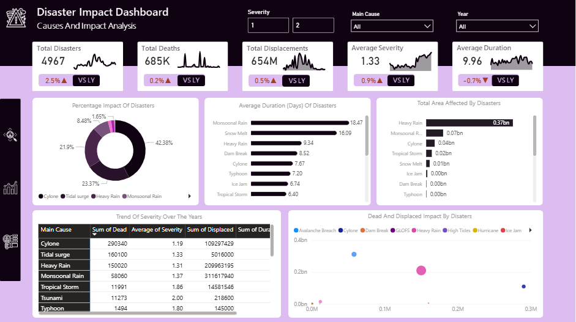
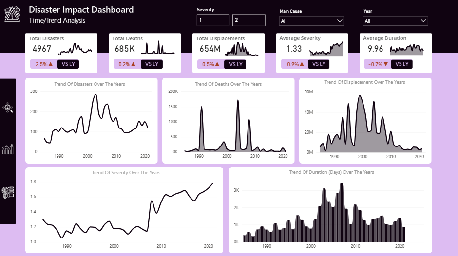

# Disaster-Impact-Analysis

---
# Introduction
This project analyzes worldwide disaster events to uncover geographic, temporal, and impact-based insights. Using Excel for data cleaning and preparation, and Power BI for interactive visualization, the dashboard highlights disaster hotspots, trends over time, and the human and environmental consequences of different disaster causes.

# Problem Statement
- Which countries experience the most severe disasters?
- Do certain causes tend to produce longer-lasting or more damaging effects?
- How do deaths, displacement, and severity interact?

# Skills Demonstrated
1. Data Cleaning (Power Query)
2. Data Visualization
3. DAX
4. Page Navigation
5. Buttons

# Data Transformation
| Dirty Data | Cleaned Data |
|:----------:|:------------:|
|  |  |

## Data Cleaning Process
- Standardized Column Names E.g Changed "Began" tp "Start_Date", "Ended" to "End_Date", etc
- Glide Number consisted of 0s and 1s, it wasnt used for analysis
- Country Column - There were a lot mispelings, a mapping table was used to compare incorrect spellings and replace them the correct one
  
- The `Duration (days)` column was created with:  
`End_Date - Start_Date`
- Validation Column - Contanied lot of redundant values e.g "new", "new/media", "news and Glide" . I segmented them into parts so it will be consistent
- Main_Cause column - Contanied lot of redundant values e.g "rain", "heavy rain", etc. I also segmented all into consistent parts for easier analysis with
  `If contains "rain" replace with "heavy rain"`
  
Then it was loaded to Power BI for Visualizatiion

# Analysis and Visualization

## Which countries experience the most severe disasters?

- Looking at deaths - India sufferd the most with a stageering number of 54k, a big difference from the second placed Chine which suffered 32k deaths, Phillipines are third with 20k deaths and quite a margin fro 4th placed United States with 10k deaths. The next placed country is with 6k deaths and there is no much difeerence going down. The top 4 sufferd more combined than all other countries.
- For Displacemnts - India comes top again with a ridiculous 188M displacements (28% of total displacement), followed by China with 110M displacemnents (16% of total), with a big margin, Phillipines comes next with 27M displacements, then a couuntry not in top 4 deaths shows up in 5th with 13M displacemrnts, US also comes 5th with 10M displacments. With a difference of 5M from the next placed country and 1M difference more or less going down
- For Disaster Count - Unites States experienced the most with 574 cases, China appeared second with 363 cases, followe by India with 283 disasters, Indonesia and Phillipines followed closely in 4th and 5th respectively. Others followed with no much difference from each other
---
## Do certain causes tend to produce longer-lasting or more damaging effects?

- Long lasting effect is proportinal to for how long it happened across countries so we look at the average duration by main causes
    - Monsoonal Rain with an average of 18.47 days proved that it happened over prlonged number of days
    - Snow Melt comes second with an average of 16.09 days
    - Heavy rain fall appears third with average of 9.34 days
    - Dam Breake comes fourth wwith average of 8.52 days
    - Cyclone came fifth with average of 7.67 days
    -Other Disasters followed with not much differrence from each other
- For More damaging effects we look at Total Area affected most importantly, then the deaths and displacements
    - In Area affected
      Heavy rain affected the highest with a stagerring 370M km2, with a big margin Monsoonal Rain came next with 71M km2, Cyclone came next with 40M km2 affected, Topical Storm with 23M km2 Area Affected came next followed by Snow melt with 14M km2. Others significanly lower than the top 5 followed each other wityh not much difference
    - In displacement Caused by Disasters - monsoonal Rain came first with 300M displaced, Heavy rain next with 200M, Cyclone with 100M displaced came next, with a big difference Tropical Storm came fourth with 14M displacements,Tidal Surge came next with 5m displacements, others followed closely with each other.
    - In deaths Caused by disasters - cyclone caused the most with 290K deaths, followed by Tidal Surge with 160k deaths, followed by heavy Rain with 150k deaths, Monsoonal Rain came next with 58K deaths, while Tsunami and Tropical Storm Came with 11k deaths each, others followed but signicanrtly tjan these first 5
---
## How do deaths, displacement, and severity interact?

Looking At the Temporal Of each of them, we can say High death doe not mean high severity, high displacement too doe not mean high severity because In 2004, highest death was recorded and severity was relatively low with 1.17 average severity. 
Also in 1999 highest displacement was recorded but severuty was at 1.27, so they dont relatively acffect each other except in som years.

# Conclusion And recommendation
- For Countries 
  - Despite them having highest number of disaster happenings, they managed to stay out of top three in deaths and displacement, we might want to say it is due to not being severe but the average sevrity was 1.44 which is pretty high, this shows that disaster mangement techniques was employed, Countries like China and mosrt especially India and all other countries should learn from them to prevent or minimize damage

- For Impact
  - Five types of Disasters kept appearing when we measured impact by duration, area affected, deaths and displacement caused - Heavy Rain fall, Monsoonal Rain, Tropical Storm, Tidal Surge and Cyclone - Countries that experience this types of disasters should try to watch out for them through forecasting and not wait till they occur to employ Disaster Management Techniques to prevent or minimize impact. They cant be stopped but can be contained if they plan and prepare for it.

- For Interaction of Different measures (displacemment, deaths and severity)
  - Counties Should Plan well and based on the type of Disaster they experiance whether it has high severity or not to prevent and minimize ipmact.
 ---   
Disasters cannot be completely stopped, but their effects can be greatly reduced through proper planning and preparedness. This analysis has shown the main risks and impacts, while the recommendations provide steps to minimize damage and support quick recovery. By putting these measures in place and reviewing them regularly,countries, states, communities and organizations can stay safer and more resilient in the face of future disasters.

---
You Can view the interactive Power BI dashboard [here](https://app.powerbi.com/links/ks9gIDF382?ctid=a36e1a13-c829-4154-8635-f2516711db50&pbi_source=linkShare)

