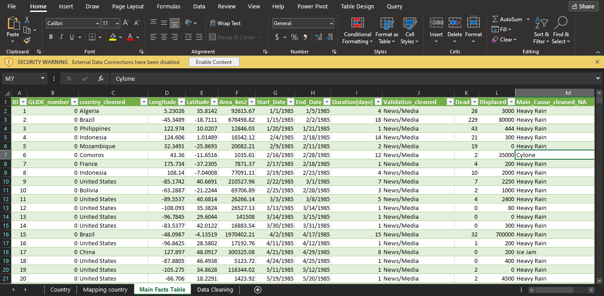
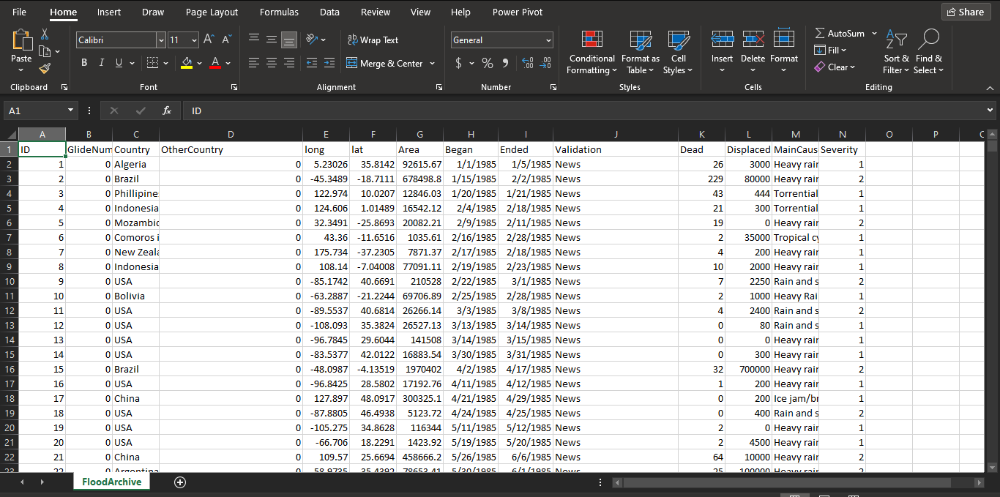
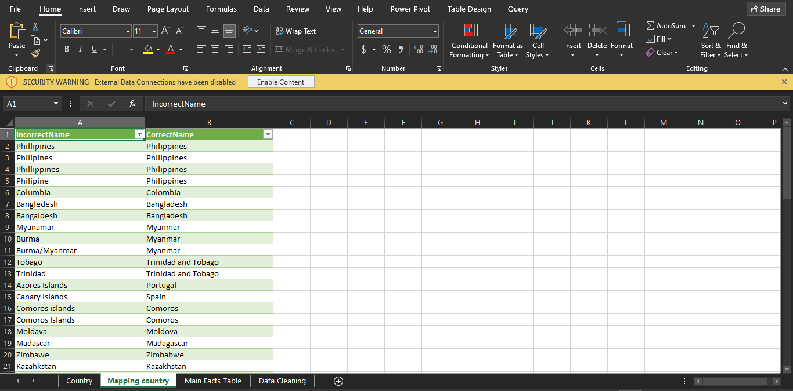
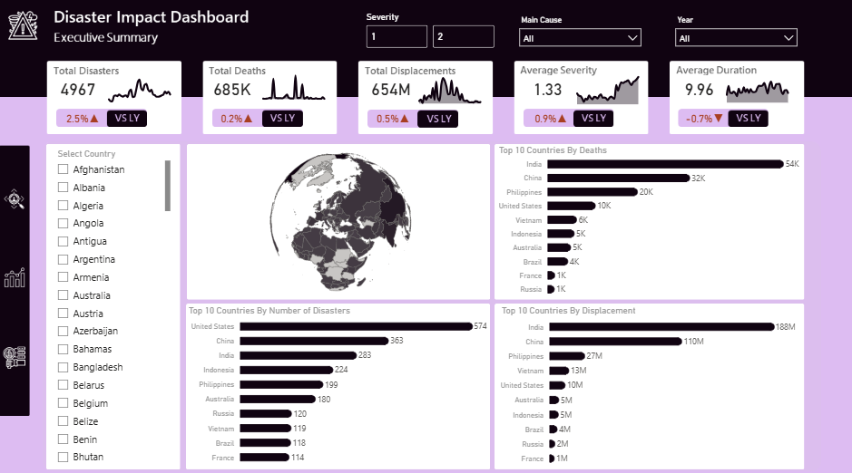

# Disaster-Impact-Analysis

---
# Introduction
This project analyzes worldwide disaster events to uncover geographic, temporal, and impact-based insights. Using Excel for data cleaning and preparation, and Power BI for interactive visualization, the dashboard highlights disaster hotspots, trends over time, and the human and environmental consequences of different disaster causes.

# Problem Statement
- Which countries experience the most severe disasters?
- Do certain causes tend to produce longer-lasting or more damaging effects?
- How do deaths, displacement, and severity interact?

# Skills Demonstrated
1. Data Cleaning (Power Query)
2. Data Visualization
3. DAX
4. Page Navigation
5. Buttons

# Data Transformation
| Dirty Data | Cleaned Data |
|:----------:|:------------:|
|  |  |

## Data Cleaning Process
- Standardized Column Names E.g Changed "Began" tp "Start_Date", "Ended" to "End_Date", etc
- Glide Number consisted of 0s and 1s, it wasnt used for analysis
- Country Column - There were a lot mispelings, a mapping table was used to compare incorrect spellings and replace them the correct one
  
- The `Duration (days)` column was created with:  
`End_Date - Start_Date`
- Validation Column - Contanied lot of redundant values e.g "new", "new/media", "news and Glide" . I segmented them into parts so it will be consistent
- Main_Cause column - Contanied lot of redundant values e.g "rain", "heavy rain", etc. I also segmented all into consistent parts for easier analysis with
  `If contains "rain" replace with "heavy rain"`
  
Then it was loaded to Power BI for Visualizatiion

# Analysis and Visualization

## Which countries experience the most severe disasters?

Looking at deaths - India sufferd the most with a stageering number of 54k, a big difference from the second placed Chine which suffered 32k deaths, Phillipines are third with 20k deaths and quite a margin fro 4th placed United States with 10k deaths. The next placed country is with 6k deaths and there is no much difeerence going down. The top 4 sufferd more combined than all other countries.
For Displacemnts - India comes top again with a ridiculous 188M displacements (28% of total displacement), followed by China with 110M displacemnents (16% of total), with a big margin, Phillipines comes next with 27M displacements, then a couuntry not in top 4 deaths shows up in 5th with 13M displacemrnts, US also comes 5th with 10M displacments. With a difference of 5M from the next placed country and 1M difference more or less going down

